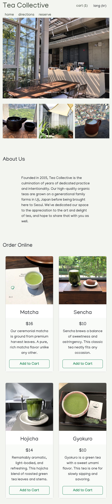

# Bilingual React Teashop - Tea Collective

React Teashop is a responsive homepage for Tea Collective. This website has two language options (Korean and English) that users can toggle between on all pages of the site. In addition to providing information the shop as well as a reservatin page, it also offers several tea products for sale and a fully functional shopping cart made with React's Context API where users can add, increment, decrement, and delete products, which are persisted in the website's state.

Mobile Version

Example products

Cart

# Tea Collective

TypeScript, JavaScript, React, HTML5, CSS3, Bootstrap, react-router-dom v6, React Context API
